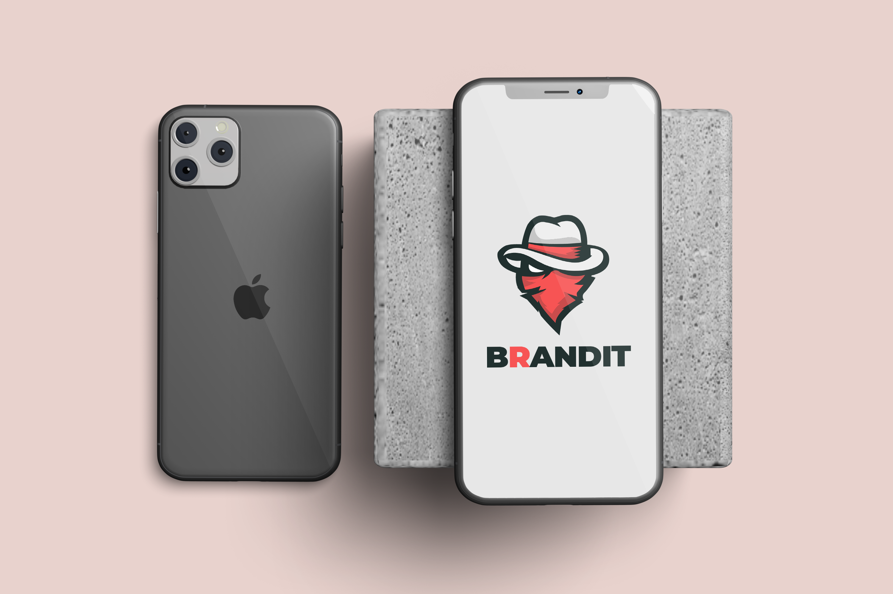
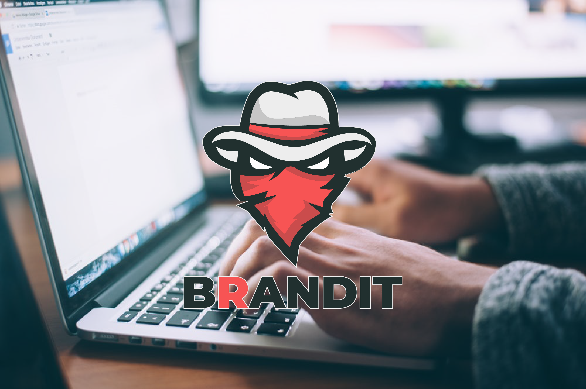

# Brandit   
 
 ## Automated Instagram Interactions Platform      
 
Instagram platform for social network connectivity and interaction enhacement using **Python** scripts and sophisticated bots.

Platform is using **InstaPy** module to access several different scripts and algorithms of various interaction priciples.
Instagram account you're developing will be able to like, comment, follow, unfollow or interact (combination of previous options) with desired targeted or random account.

All these options could be applied on desired #hashtags, locations or pick up the followers list from another targeted account.

Interactions work more humanly where you set what the interaction shoud look like. Some of my tested and ready to use methods are in the **scripts** folder.

With the right amount of interactions, it can get you from 1k to 3k **real followers** on a monthly basis, depending on how interesting your account is.

<p align="center">
  
</p>


## Requirements
 - instapy
 - websocket-client
 - requests
 - python-dotenv

## Installation
```elm
pip install -r requirements.txt
```
**Important:** depending on your system, make sure to use pip3 and python3 instead.

Or go into assets and you should find instapy_installation folder with install steps for all devices.


<p align="center">
  
</p>

## Caution

Use at your own risk. Start slowly and develop account integrity on Instagram, then you'll be able to push more server calls and get more followers.

Instagram is updating it's bot detection algorithms on a daily basis. Test new scripts as you develop your profile.

If you get caught by Instagram, you'll get a no calls to server ban for 24 hours. If you get caught again, penalties get bigger and bigger.

Running multiple scripts is possible using proxies.

## What's included

Within the download you'll find common assets providing both compiled and minified variations. You should see something like this:

```text
Brandit/
└── assets/
    ├── instapy_installation/
    │   ├── Linux/
    │   ├── MacOs/
    │   ├── RapsberryPi/
    │   └── Windows/
    ├── brandit_cover.png
    ├── brandit_front.png
    └── geckodriver.exe
```
